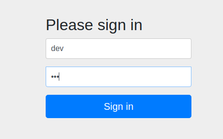
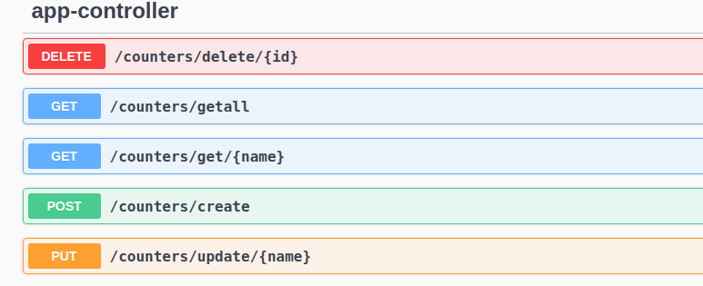
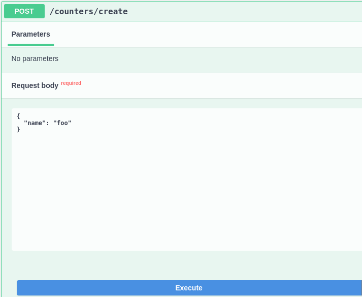
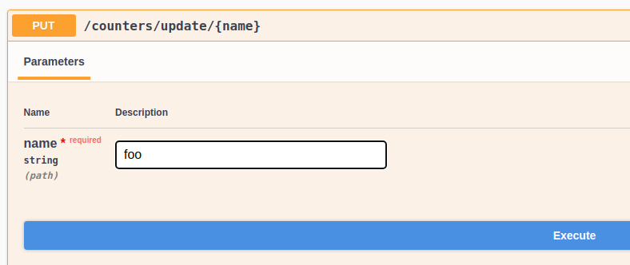
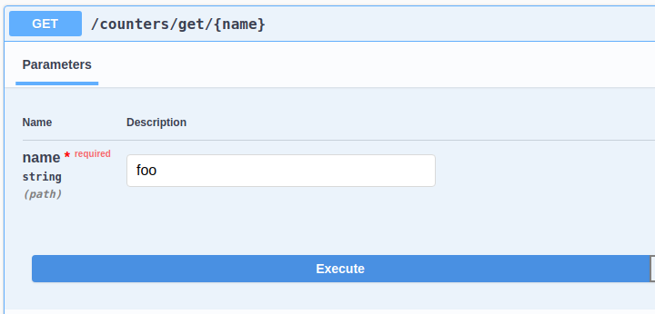
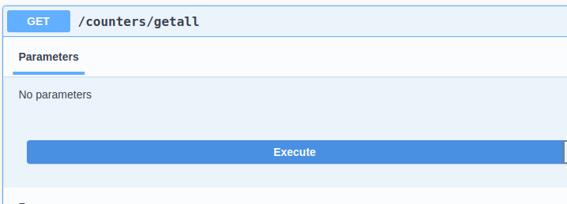
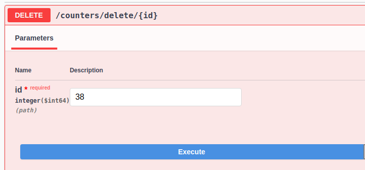

# Description
A simple service application counters that keeps a list of counters for implementing CRUD operations and
saves the response.

##Login page
```  
username: dev 
password: dev 
``` 


## Swagger
http://localhost:8080/swagger-ui.html  


## H2 Console
http://localhost:8080/h2-console  
```  
username: sa  
password: sa  
```

## Steps to use H2 database

````  
1. Go to H2 database console http://localhost:8080/h2-console 
2. Enter username and password: sa 
3. Enter query SELECT * FROM counter_table 
4. Click on green Run button on the top
5. View all the services in the database
````


## Steps to use swagger
● Steps to Create
````  
Example of /counters/create

POST : /counters/create
1.Click on Try it out
2.Enter Request body: 
{
  "name": "foo"
}
3.Click on execute.
4. In the response body:
{
  "id": 38,
  "name": "foo",
  "value": 0,
  "createdAt": "2021-10-20T02:10:17.480966949",
  "updatedAt": "2021-10-20T02:10:17.48104224"
}
5. Verify the service added to h2 database on h2 console

````  



● Steps to Update
````  
Example of counters/update/{name}

PUT : /counters/update/{name}
1.Click on Try it out
2. Enter name : foo

3.Click on execute.
4. In the response body:
{
  "id": 38,
  "name": "foo",
  "value": 1,
  "createdAt": "2021-10-20T02:10:17.480967",
  "updatedAt": "2021-10-20T02:17:29.540260903"
}
5. The counter increments the value by 1 on every update. 
Verify the service updated to h2 database on h2 console
````



● Steps to Read

```` 
Example of counters/get/{name} 

GET : /counters/get/{name}
1.Click on Try it out
2. Enter name : foo
3. Click on execute.
4. In the response body:
{
  "id": 38,
  "name": "foo",
  "value": 1,
  "createdAt": "2021-10-20T02:10:17.480967",
  "updatedAt": "2021-10-20T02:17:29.540261"
}
5. Shows the current value of the counter. 
Verify the services on h2 console
````



````  
Example of counters/getall

GET : /counters/getall
1.Click on Try it out
2.Click on execute.
3. In the response body:
[
  {
    "id": 33,
    "name": "bar",
    "value": 3,
    "createdAt": "2021-10-17T23:30:35.061198",
    "updatedAt": "2021-10-17T23:38:26.692977"
  },
  {
    "id": 34,
    "name": "pepsi",
    "value": 0,
    "createdAt": "2021-10-17T23:40:55.067227",
    "updatedAt": "2021-10-17T23:40:55.067285"
  },
  {
    "id": 35,
    "name": "cola",
    "value": 0,
    "createdAt": "2021-10-17T23:41:10.922952",
    "updatedAt": "2021-10-17T23:41:10.923001"
  },
  {
    "id": 38,
    "name": "foo",
    "value": 1,
    "createdAt": "2021-10-20T02:10:17.480967",
    "updatedAt": "2021-10-20T02:17:29.540261"
  }
]

4. Verify the services on h2 console
````



● Steps to Delete
````  
Example of counters/delete/{id}

DELETE : /counters/delete/{id}
1.Click on Try it out
2. Enter id : 38
3.Click on execute.
4. In the response body:
CounterEntity(id=38, name=foo, value=1, createdAt=2021-10-20T02:10:17.480967, updatedAt=2021-10-20T02:17:29.540261)
 is Deleted successfully
5. Verify the service deleted in h2 database on h2 console
````



## Technologies used
● Java 11  
● Spring boot v2.5.4  
● Spring data jpa  
● Lombok   
● Swagger v3  
● H2 database  


